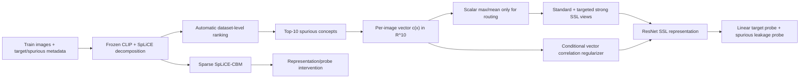

# Как обновить отчёт после переработки SpurSpLiCE

Этот документ сравнивает реализацию до глобального аудита (`40e31f0`) с текущей версией (`0198e3b`). Он относится к отчёту `SpLiCE Integration for SpurSSL Waterbirds Experiments`, в котором уже приведены старые результаты для Waterbirds и SpurCIFAR10.

## Короткий ответ

Старая версия использовала SpLiCE в основном как генератор одного числа для каждого изображения:

1. выбирался общий список концептов;
2. их веса усреднялись или сводились через `max` в один scalar score;
3. этот score либо включал сильную аугментацию, либо декоррелировался с SSL embedding.

Новая версия сохраняет top-10 выбранных концептов как настоящий вектор из десяти компонент. Scalar score остался только маршрутизатором для `augment`. В `corr_reg` используется вся матрица корреляций `embedding dimension x concept`, причём по умолчанию она вычисляется после центрирования внутри каждого target-класса. Это предотвращает очевидную ошибку старого regularizer: он мог штрафовать полезный class signal просто потому, что spurious attribute коррелирует с target в train data.

Кроме того, теперь весь путь автоматизирован: train split декомпозируется, dataset-level top-10 spurious concepts выбираются по metadata, threshold для аугментации берётся как train quantile, результаты кэшируются, после чего начинается SSL. Ручные названия вроде `water,forest,...` и ручной threshold больше не обязательны.

При этом важно честно сформулировать границу автоматизации:

- человеку не нужно выбирать названия концептов или изображения;
- алгоритму всё ещё нужны target и spurious metadata для каждого benchmark dataset;
- `corr_reg` по умолчанию использует target labels внутри SSL loss;
- следовательно, pipeline автоматический, но не metadata-free, а `corr_reg` ещё и не label-free.

[Оригинальная статья SpLiCE](https://arxiv.org/abs/2402.10376) предлагает sparse nonnegative concept representation, обнаружение bias и прямое редактирование SpLiCE representation/probe. `augment` и `corr_reg` являются расширениями этого проекта, а не алгоритмами из статьи. Новый `SpLiCE-CBM` baseline наиболее близок к intervention из статьи.

## Ментальная модель нового pipeline



Здесь есть два разных значения слова top-10:

- SpLiCE действительно декомпозирует каждое изображение и получает его sparse concept weights;
- для обучения выбираются десять **общих для датасета** концептов, наиболее связанных со spurious metadata после conditioning on target;
- затем для каждого изображения сохраняются его десять весов по этому общему набору;
- произвольный per-image top-10 нужен только для аудита и по умолчанию не записывается.

Общий набор нужен потому, что loss должен сравнивать одну и ту же координату между изображениями. Нельзя корректно интерпретировать column 3 как `water` у одного изображения и как `bird` у другого.

## Что конкретно изменилось

### 1. Scalar score заменён concept vector там, где это важно

Пусть SpLiCE возвращает sparse nonnegative decomposition

\[
    w(x) \in \mathbb{R}^{V}_{\ge 0}, \qquad V=10000.
\]

После автоматического выбора набора `C` из `K=10` концептов новая версия хранит

\[
    c(x) = w_C(x) \in \mathbb{R}^{K}_{\ge 0}.
\]

В старой версии сразу вычислялось одно число

\[
    r(x)=\operatorname{mean}_{k\in C}c_k(x)
    \quad\text{или}\quad
    r(x)=\max_{k\in C}c_k(x),
\]

и вся информация о том, какой именно concept активирован, терялась. Например, изображение с большой активацией `water` и изображение с большой активацией `forest` могли получить одинаковый score. Для routing это допустимо, но для regularization это слишком грубо.

В новой версии `r(x)` используется только в `augment`, а `corr_reg` получает полный `c(x)`.

### 2. `corr_reg` стал vector-valued и conditional on target

Старая версия штрафовала корреляцию каждой embedding dimension с одним scalar score:

\[
    \mathcal{L}_{\mathrm{old\mbox{-}reg}}
    = \lambda\frac{1}{d}\sum_{j=1}^{d}\rho(h_j,r)^2.
\]

Проблема: в biased train set фон связан с классом. Поэтому глобальная корреляция `embedding <-> background score` содержит одновременно вредный background signal и полезный target signal. Старый loss не умел их различать.

В новой версии для batch embeddings `H in R^{n x d}` и concept weights `C in R^{n x K}` сначала выполняется центрирование внутри каждого target-класса:

\[
    \widetilde h_i
    = h_i-\frac{1}{|B_{y_i}|}\sum_{j\in B_{y_i}}h_j,
    \qquad
    \widetilde c_i
    = c_i-\frac{1}{|B_{y_i}|}\sum_{j\in B_{y_i}}c_j.
\]

Затем вычисляется полная cross-correlation matrix

\[
    R_{jk}
    = \frac{\sum_i \widetilde h_{ij}\widetilde c_{ik}}
    {\sqrt{\sum_i\widetilde h_{ij}^2}
     \sqrt{\sum_i\widetilde c_{ik}^2}+\varepsilon},
\]

и loss

\[
    \mathcal{L}_{\mathrm{SpLiCE}}
    = \lambda\frac{1}{dK}\sum_{j=1}^{d}\sum_{k=1}^{K}R_{jk}^2.
\]

Полный objective:

\[
    \mathcal{L}=\mathcal{L}_{\mathrm{SimCLR}}+\mathcal{L}_{\mathrm{SpLiCE}}.
\]

Обе SimCLR views имеют один и тот же frozen concept vector, поэтому labels и concept vectors повторяются для двух embeddings.

Это не означает «найти neuron воды и выключить его». В ResNet и SpLiCE нет one-to-one соответствия нейронов. Loss мягко мешает любой линейной комбинации ResNet features кодировать выбранные SpLiCE concepts внутри фиксированного target-класса.

По умолчанию это label-conditioned regularization. Для отдельной label-free ablation существует

```bash
--splice_conditional_on_target false
```

но глобальный вариант с большей вероятностью удалит часть полезного target signal.

### 3. `augment` теперь создаёт настоящую invariance pair

Старая логика для high-score sample применяла один тип transform к обеим views:

\[
    [T_{\mathrm{strong}}(x),T_{\mathrm{strong}}(x)].
\]

Новая логика всегда сохраняет первую стандартную view:

\[
  \begin{cases}
    [T_{\mathrm{std}}(x),T_{\mathrm{strong}}(x)], & r(x)\ge\tau,\\
    [T_{\mathrm{std}}(x),T_{\mathrm{std}}(x)], & r(x)<\tau.
  \end{cases}
\]

Это более прямой SimCLR-сигнал: модель должна сопоставить обычный вид изображения с видом, в котором shortcut сильнее нарушен. При двух strong views полезный объект мог быть испорчен в обеих views.

Важно: `augment` без `--splice_strong_*` использует standard transform и фактически не добавляет нового воздействия. Для основного automatic experiment нужна заранее зафиксированная общая policy, например crop + color jitter + grayscale + blur. Она не использует ручные названия concepts, но всё ещё является выбранным экспериментатором набором generic augmentations.

### 4. Threshold теперь data-relative, а не ручной

Старая версия использовала абсолютные thresholds `0.03`, `0.05`, `0.085`, `0.1`. Такие числа зависят от списка concepts, L1 penalty, модели SpLiCE, датасета и `mean/max` reduction. Их нельзя переносить на новый top-10 или другой dataset.

Новая версия по умолчанию использует

\[
    \tau=Q_{0.75}\left(\{r(x_i)\}_{i=1}^{N}\right),
\]

то есть strong second view получают примерно 25% train images с наибольшим score. Для routing рекомендуется `max`, потому что достаточно сильной активации хотя бы одного spurious concept:

```bash
--splice_score_reduction max \
--splice_score_threshold auto \
--splice_score_quantile 0.75
```

Это не делает `q=0.75` теоретически оптимальным; оно делает правило воспроизводимым и переносимым между датасетами.

### 5. Automatic concept discovery исправлен и включён в training entrypoint

Для concept `k` определяются group means

\[
    \mu_k(s,y)=\mathbb{E}[c_k(x)\mid s(x)=s,y(x)=y].
\]

Для бинарного benchmark текущая логика эквивалентна

\[
    \mathrm{Spurious}_k
    =\frac{1}{|\mathcal{Y}|}\sum_y
      |\mu_k(1,y)-\mu_k(0,y)|,
\]

\[
    \mathrm{Target}_k
    =\frac{1}{|\mathcal{S}|}\sum_s
      |\mu_k(s,1)-\mu_k(s,0)|,
\]

\[
    \mathrm{Instability}_k
    =\operatorname{Std}_y
      \left(|\mu_k(1,y)-\mu_k(0,y)|\right),
\]

\[
    \mathrm{Score}_k
    =\mathrm{Spurious}_k
     -\lambda_y\mathrm{Target}_k
     -\lambda_{\mathrm{inst}}\mathrm{Instability}_k.
\]

Для multi-valued attributes код усредняет абсолютные pairwise differences.

В PDF формула `Target_k` уже написана как полная binary pairwise difference. Однако старая реализация использовала mean absolute deviation от target mean. При двух target values это равно половине pairwise difference. Значит, старая программа штрафовала class-related concepts в два раза слабее, чем утверждал отчёт. Новая реализация исправлена и теперь соответствует приведённой выше формуле.

Формулу `Instability_k` в PDF нужно поправить: код берёт standard deviation **модулей** spurious effects, а не signed differences. Это соответствует смыслу «стабильна ли сила spurious association между target classes».

Теперь достаточно передать

```bash
--splice_concepts auto --splice_auto_top_k 10
```

или вообще оставить `--splice_concepts` пустым при включённом SpLiCE mode.

### 6. Добавлен SpLiCE-CBM и два прямых intervention

Это отдельный baseline, не ResNet SSL training. Для каждого изображения строится полный sparse SpLiCE vector `w(x) in R^10000`, затем на target labels обучается L1 logistic probe без intercept:

\[
    \widehat y=\operatorname{argmax} Ww(x).
\]

После автоматического выбора spurious concept indices `I` сравниваются:

1. baseline: неизменённые `w` и `W`;
2. representation intervention: `w_k(x)=0` для `k in I`;
3. probe intervention: `W_{:,k}=0` для `k in I`.

Это наиболее прямой ответ на вопрос «помогает ли удаление найденных concepts?», и он ближе всего к model editing case study оригинальной статьи. Но это ответ для SpLiCE/CLIP representation, а не для обученного ResNet encoder.

### 7. CelebA теперь совместим с SpurSSL/LateTVG

Старая версия:

- target: `Male`;
- spurious attribute: `Blond_Hair`.

Новая версия:

- target `y`: `Blond_Hair` (`not_blond` / `blond`);
- spurious attribute `s`: `Male` (`female` / `male`);
- worst groups: комбинации `(gender, hair target)`.

Все старые CelebA numbers с обратной постановкой задачи нельзя сравнивать с новой версией или SpurSSL/LateTVG.

### 8. Linear probe теперь действительно запускается каждые 25 SSL epochs

В старом loop была скрытая связь двух независимых настроек. Проверка `linear_probe_freq=25` находилась внутри блока `epoch % save_freq == 0`. При default `save_freq=50` periodic probe поэтому запускался бы каждые 50 epochs, а не 25.

Однако предоставленная команда старого SpurCIFAR10 run явно содержит `--save_freq 25`. Для этого run обе проверки совпадали, поэтому probe действительно запускался каждые 25 SSL epochs. Старые numbers из этого запуска не имеют ошибки частоты. Проблема состояла в хрупкой зависимости: изменение checkpoint frequency незаметно меняло evaluation frequency. В новой версии эти расписания разделены.

Теперь:

- каждые 25 SSL epochs создаётся временный `probe_tmp.pth`;
- encoder замораживается;
- linear classifier обучается 100 epochs;
- metrics пишутся в W&B на текущем SSL step;
- временный checkpoint удаляется;
- постоянные checkpoints не создаются, пока не передан `--keep_checkpoints`.

Важная формулировка для отчёта:

> `Average over last 10 linear val acc` и `Average over last 10 linear val worst-group acc` являются средними по epochs 91-100 одного 100-epoch linear probe, запущенного в конкретный SSL epoch. Это не среднее по последним десяти SSL epochs.

Для итоговой таблицы рекомендуется брать metric в заранее выбранном SSL epoch, например final epoch 1000, затем вычислять mean +/- std по seeds 0, 1, 2.

### 9. Добавлен spurious-attribute leakage probe

После обычного target probe текущая версия обучает второй linear classifier, который предсказывает spurious metadata из frozen ResNet features. Он логирует:

- `Spurious probe average over last 10 val acc`;
- `Spurious probe average over last 10 val worst-group acc`.

При сопоставимой target accuracy более низкая spurious-probe accuracy означает, что shortcut хуже линейно извлекается из representation. Это диагностическая метрика, не замена target worst-group accuracy. Из-за imbalance её нужно сравнивать только при одинаковых splits и protocol.

Auxiliary probe использует те же 100 training epochs, поэтому при включённом default один periodic evaluation обучает два отдельных linear classifiers: target probe и spurious probe. Это не меняет SSL gradients, но примерно удваивает probe overhead. Для широких development sweeps его можно временно отключить через `--linear_spurious_probe false`, а для финальных runs включить снова.

### 10. Файлы и производительность

По умолчанию **не создаётся один JSON на изображение**. Automatic discovery пишет несколько dataset-level artifacts:

- `outputs/<dataset>_splice_concepts.json`;
- `outputs/<dataset>_splice_concepts.concepts.txt`;
- `outputs/<dataset>_splice_concepts.indices.txt`;
- `outputs/<dataset>_splice_score_summary.json`;
- tensor cache размера примерно `N x 10` для выбранных concept weights.

Per-image audit является одним JSONL-файлом, а не `N` отдельными файлами, и отключён по умолчанию (`--splice_per_image_top_k 0`).

Во время discovery текущий batch всё равно имеет dense shape `B x 10000`, потому что SpLiCE должен решить decomposition, но между batches сохраняются только sparse nonzero entries. Во время 1000 SSL epochs SpLiCE заново не вызывается: DataLoader читает маленький cached `N x 10` control. Поэтому основной overhead находится перед training, а не в каждом SSL epoch.

SpLiCE-CBM отдельно кэширует полный sparse `N x 10000` matrix в compressed `.npz`; этот artifact может быть заметно больше, но он не создаётся обычным SSL run.

### 11. Инженерные исправления после Brooks-Lint audit

Эти изменения в основном повышают корректность и воспроизводимость, но сами по себе не обещают рост worst-group accuracy.

| Старая проблема | Последствие | Что исправлено |
|---|---|---|
| Три dataset loaders содержали копии `ConceptAwareSSLSubset` | Исправление в одном датасете могло не попасть в другие | Wrapper и threshold resolution вынесены в общий module |
| Scalar score использовался и для routing, и для regularization | Два разных domain concepts были смешаны в одну абстракцию | Routing score и concept vector разделены |
| Cache key не различал некоторые artifacts/configurations | Возможна загрузка устаревшего или несовместимого cache | Cache fingerprint version 2 включает artifact, pretrained model и reduction там, где он влияет |
| Discovery хранил dense `N x 10000` tensor | Большой RAM overhead | Между batches хранится sparse representation; dense остаётся только внутри batch |
| Invalid solver возвращал `RuntimeError` вместо `raise` | Объект мог продолжить работу в некорректном состоянии | Ошибка теперь действительно выбрасывается |
| ADMM жёстко использовал CUDA | CPU path ломался | Device берётся из configuration |
| Packaging исключал `experiments`, dependency CLIP была записана неоднозначно | Editable/package installs могли не импортировать entrypoints | Исправлены packages, root modules и requirement syntax |
| Новое поведение не имело characterization tests | Высокий риск тихой регрессии | Добавлены tests для CelebA semantics, vector regularizer, cache, discovery, CBM и leakage probe |

В терминах Brooks-Lint это уменьшает change propagation, knowledge duplication и domain model distortion: `score` снова означает routing scalar, `concept_weights` означает vector semantics, а dataset target/spurious roles явно названы.

## Что исправить в существующем PDF

### Заголовок и scope

Текущий заголовок говорит только о Waterbirds, но в отчёте уже есть SpurCIFAR10. Если добавляется CelebA, лучше назвать, например:

> Automatic SpLiCE-Guided Mitigation of Spurious Correlations in Self-Supervised Representations

Либо оставить Waterbirds в основном тексте, а SpurCIFAR10/CelebA вынести в отдельный section или appendix.

### Section 1: Project Summary

Заменить тезис про «two SpLiCE-based interventions» на три уровня использования:

1. automatic metadata-conditioned discovery;
2. SpLiCE-guided SSL (`augment`, `corr_reg`, combined);
3. direct SpLiCE-CBM intervention baseline.

Добавить, что SpLiCE frozen, а ResNet/SimCLR trainable. Добавить ограничение: discovery использует benchmark group metadata.

### Section 2: Brief Description of SpLiCE

Описание sparse nonnegative weights, OpenCLIP ViT-B/32, LAION-10k и L1 penalty 0.25 можно оставить.

Нужно добавить, что paper показывает use cases для bias detection и прямого editing SpLiCE representations/probes. Не следует писать, что paper предлагает именно сильные SSL augmentations или correlation regularizer: это вклад данного проекта.

### Section 3: Implementation

Workflow переписать так:

1. frozen SpLiCE декомпозирует train images;
2. group-conditioned ranking автоматически выбирает dataset-level top-10;
3. training получает per-image vector `c(x) in R^10`;
4. scalar reduction используется только для augmentation routing;
5. vector используется для conditional cross-correlation regularization;
6. linear probe идёт каждые 25 SSL epochs по 100 epochs через временный checkpoint;
7. дополнительно считается spurious leakage probe.

Фразу «model is saved periodically» заменить на «a temporary checkpoint is created only to run the probe and deleted afterwards; persistent checkpoints are opt-in».

### Section 4: Supporting Tools

Сейчас discovery уже не просто helper, который человек запускает и читает. Он встроен в `spur_splice.py` через `--splice_concepts auto`.

`summarize_splice_scores.py` оставить как audit tool. Основной threshold больше не выбирается вручную: default `q=0.75`.

Добавить, что per-image JSONL отключён, а training использует selected-vector tensor cache.

### Section 5 и Table 1: Experiment Protocol

В Table 1 есть несколько противоречий с кодом:

1. Temperature `0.05` в PDF подтверждена предоставленной командой: run явно передавал `--temp 0.05`. Таблицу менять на `0.5` не нужно. Нужно добавить `--temp 0.05` в неполную example command на последней странице и использовать то же значение во всех сравниваемых новых runs. Значение `0.5` является default SpurSSL, но переход на него был бы уже новым protocol и потребовал бы повторить все baselines.
2. Linear-probe split теперь также восстановлен точно. Поскольку `--train_set_linear_layer` не передавался, использовался default `ds_train`: downsampled group-balanced version train split. `--linear_eval_split test` передан явно, значит evaluation выполнялась на test. В Table 1 нужно написать две разные строки: `Linear-probe train split: ds_train` и `Linear-probe evaluation split: test`.
3. Использование test само по себе объясняет старые reported numbers, но test нельзя использовать для выбора threshold, augmentation policy или regularization weight. Если лучшие варианты выделялись после сравнения этих test runs, таблицы являются exploratory. Для основного результата selection нужно повторить по `val`, после чего один раз оценить зафиксированную configuration на `test`.
4. `Selected Top-10 concepts` больше не fixed setting. Это output automatic discovery, который нужно показывать отдельно для каждого dataset и run configuration.
5. Добавить `SpLiCE pretrained: laion2b_s34b_b79k`, `score reduction: max`, `threshold rule: train q75`, `linear probe frequency: 25 SSL epochs`, `linear probe duration: 100 epochs`.

Рекомендуемый протокол:

- concept discovery: train only;
- hyperparameter selection: validation WG accuracy;
- final evaluation: test only после фиксации method/hyperparameters;
- primary number per run: average over final 10 linear-probe epochs at a predeclared SSL epoch;
- aggregate: mean +/- std over seeds 0, 1, 2.

### Sections 6, Tables 2-5: Old Results

Старые results являются результатами реально существовавшего метода, но не текущего метода. Их можно:

- оставить в appendix с названием `Preliminary results with scalar SpLiCE control (legacy implementation)`;
- либо полностью заменить новыми таблицами;
- нельзя смешивать legacy rows и current rows в одной таблице без явного version column.

Фразу «best worst-group accuracy is obtained when all augmentations are used together» нужно ослабить. Для Waterbirds seed 1 в Table 3 grayscale даёт WG `55.98`, а all augmentations `52.46`. Корректнее:

> Averaged across the three seeds, the combined augmentation policy achieved the strongest worst-group result, although the best individual policy varied by seed.

В Table 2 для Waterbirds seed 1 threshold `0.1` имеет WG `53.57`, выше `52.46` при `0.03`, хотя bold стоит на `0.03`. Если bold обозначает primary WG metric, выделение неверно. Лучше отдельно bold maximum average accuracy и maximum WG accuracy или вообще показывать mean +/- std по seeds.

Если эти thresholds/weights выбирались по test table, результаты следует назвать exploratory и заново выполнить selection на validation set.

Предоставленный SpurCIFAR10 run использовал только четыре вручную заданных concepts: `pink,purple,orange,safety`. Следовательно, соответствующая Table 5 проверяет manual four-concept routing, а не automatic top-10 discovery. Это нужно явно указать в caption/Methods; после нового запуска её нельзя подписывать как результат automatic pipeline.

`wandb-summary.json` подтверждает происхождение строки seed 2 / all augmentations: при `_step=1000` получены `Average over 10 last linear val acc = 63.233` и `Average over last 10 linear val worst-group acc = 27.790699`, совпадающие с PDF. Значит, таблица использует average epochs 91-100 финального linear probe на SSL epoch 1000, а не best probe и не среднее по SSL epochs.

### Sections 7.1-7.4: Discovery formulas

`Spurious_k`, `Target_k` и final score в целом можно оставить, но:

- явно написать, что новая code implementation использует полные pairwise target differences;
- заменить signed instability на `Std_y(|Delta_spur(y)|)`;
- добавить general pairwise formulation, если section должен покрывать SpurCIFAR10 с десятью line-color values.

Старый top-10 список `bamboo, forests, whale, ...` не следует объявлять fixed concepts новой системы. После ranking fix нужно вставить новый автоматически полученный список и сохранить score/components для воспроизводимости.

### Section 7.5: Correlation Regularization

Эту секцию нужно заменить полностью: scalar `r_i` больше не используется regularizer. Вставить vector/conditional формулы из section 2 этого guide.

Обязательно назвать method label-conditioned. Не приписывать этот loss авторам SpLiCE paper.

### Section 7.6: Score Distribution

Оставить scalar score только как augmentation routing score. Добавить automatic quantile threshold:

\[
    \tau=Q_q(\{r_i\}_{i=1}^{N}),\qquad q=0.75.
\]

Абсолютные threshold counts можно оставить как legacy ablation, но не как основной automatic protocol.

### Section 8: Commands

Ручные три шага `discover -> summarize -> copy names -> train` заменить одной automatic command. Отдельные tools оставить как audit/debug commands.

Также добавить SpLiCE-CBM command и явно указать, что per-image audit opt-in.

## Нужно ли переделывать старые обучения

### Обязательно переделать

1. **Все старые `corr_reg` runs.** Objective изменился со scalar global correlation на conditional vector correlation. Старые weights `0.0001-0.005` относятся к другой шкале loss и не являются meaningful sweep для нового objective.
2. **Все CelebA runs.** Target и spurious attribute поменялись местами.
3. **Все runs, использующие старый автоматически найденный top-10.** Ranking fix усилил target penalty до той величины, которая уже была написана в отчёте; список может измениться.
4. **Augmentation runs, если они должны называться результатом current method.** Теперь high-score pair равна standard+strong, а раньше была strong+strong.
5. **Runs, где hyperparameters были выбраны по test results.** Selection нужно выполнить по val, test использовать после фиксации.

### Можно сохранить только как preliminary/legacy

- Waterbirds и SpurCIFAR10 old augmentation tables;
- fixed-threshold ablations;
- old scalar regularization table.

Они полезны как история разработки и показывают, что идея давала сигнал, но не доказывают эффективность текущего automatic pipeline.

### Baseline

`splice_mode=none` почти не изменился алгоритмически. Теоретически старый baseline можно переиспользовать, если из W&B подтверждены одинаковые:

- commit-independent data split;
- model и temperature;
- seed;
- final SSL epoch;
- linear train/eval split;
- metric definition.

Практически лучше заново запустить baseline на seeds 0, 1, 2. Это дешевле, чем потом объяснять, почему baseline и method rows получили разные probe schedule или evaluation protocol. Если compute очень ограничен, старый baseline - единственный тип run, который допустимо переиспользовать после строгой проверки W&B config.

## Какие новые обучения запустить

### Сначала зафиксировать protocol

Для всех methods и datasets:

- SSL epochs: 1000;
- seeds: 0, 1, 2;
- probe every 25 SSL epochs;
- each probe: 100 epochs;
- linear train split: `ds_train` для совместимости со SpurSSL/LateTVG;
- development eval split: `val`;
- final reported split: `test` только после фиксации settings;
- target metric: `Average over last 10 linear val worst-group acc`;
- secondary metric: corresponding average accuracy;
- diagnostic: spurious leakage probe;
- no persistent checkpoints.

Если время кластера ограничено, в preliminary sweeps допустимо передать `--linear_spurious_probe false`; primary target metrics от этого не меняются. В финальном сравнении leakage probe лучше включить.

Для прямого продолжения фактических старых runs использовать `--temp 0.05`: это подтверждено command line. Вариант `0.5` можно исследовать отдельно как SpurSSL-default ablation, но его нельзя незаметно смешивать с таблицами, полученными при `0.05`.

### Минимальный убедительный experiment matrix

Для каждого dataset:

| Method | Seeds | Назначение |
|---|---:|---|
| SimCLR baseline | 0,1,2 | Точка отсчёта |
| Automatic SpLiCE-AUG q75 | 0,1,2 | Основной automatic augmentation method |
| Automatic conditional vector REG | 0,1,2 | Проверка representation penalty |
| AUG + REG | 0,1,2 | Проверка комплементарности |
| Automatic SpLiCE-CBM | 0,1,2 или один deterministic run | Прямой concept intervention baseline |

Это 12 полных SSL runs на dataset, то есть 36 для Waterbirds, CelebA и SpurCIFAR10 вместе. CBM значительно дешевле полного SSL после decomposition cache.

Если compute ограничен, сначала полностью сделать Waterbirds. Затем для CelebA и SpurCIFAR10 запустить baseline+AUG на трёх seeds, а REG/combined добавить после подтверждения эффекта.

### Development sweeps

Не переносить старые absolute thresholds и regularization weights.

На Waterbirds seed 0, используя только validation metrics:

- `augment`: основной `q=0.75`; полезная ablation `q in {0.50, 0.75, 0.90}`;
- `corr_reg`: начальный log-scale sweep `lambda in {0.001, 0.01, 0.1}`;
- выбрать lambda по validation WG при контроле average accuracy и magnitude `SSL splice loss`;
- после выбора не менять lambda по test results.

Новый regularizer усредняет squared normalized correlations, поэтому его scale отличается от старого scalar loss. Значения `0.0001-0.005` не следует автоматически считать релевантными.

Отдельная научно важная ablation:

- conditional vector REG: `--splice_conditional_on_target true`;
- global vector REG: `--splice_conditional_on_target false`.

Она показывает, действительно ли conditioning защищает target information.

### Dataset-specific expectations

**Waterbirds**

- target: bird type;
- spurious: background;
- SpLiCE может найти `water`, `lake`, `forest`, `tree`, но exact words не гарантированы;
- основной ожидаемый эффект: рост minority landbird-on-water / waterbird-on-land groups.

**CelebA**

- target: blond hair;
- spurious: gender;
- color/grayscale augmentation может одновременно разрушать shortcut и полезный hair-color target;
- поэтому обязательно следить и за average accuracy, и за WG, и сравнить AUG с conditional REG.

**SpurCIFAR10**

- target: CIFAR-10 class;
- spurious: десять line colors;
- group space: 100 `(class, line_color)` groups;
- low resolution делает natural-language concepts SpLiCE менее надёжными; ожидаемы words вроде `stripe`, `banner`, `color` или вообще noisy concepts;
- `--splice_strong_line_recolor true` является oracle upper-bound, потому что использует человеческое знание точного shortcut. Его можно показывать отдельной строкой `Oracle`, но нельзя включать в основной automatic method.

## Рекомендуемые команды

Ниже показан Waterbirds. Для CelebA заменить dataset на `celeba`; для SpurCIFAR10 использовать `--dataset spur_cifar10 --model resnet18`.

### Baseline

```bash
python spur_splice.py \
  --dataset waterbirds \
  --data_folder ./datasets \
  --model resnet18_large \
  --epochs 1000 \
  --temp 0.05 \
  --seed 0 \
  --splice_mode none \
  --linear_probe_freq 25 \
  --linear_probe_epochs 100 \
  --train_set_linear_layer ds_train \
  --linear_eval_split val \
  --use_wandb
```

### Automatic augmentation

```bash
python spur_splice.py \
  --dataset waterbirds \
  --data_folder ./datasets \
  --model resnet18_large \
  --epochs 1000 \
  --temp 0.05 \
  --seed 0 \
  --splice_mode augment \
  --splice_concepts auto \
  --splice_auto_top_k 10 \
  --splice_score_reduction max \
  --splice_score_threshold auto \
  --splice_score_quantile 0.75 \
  --splice_strong_crop true \
  --splice_strong_color_jitter true \
  --splice_strong_grayscale_p true \
  --splice_strong_blur_p true \
  --linear_probe_freq 25 \
  --linear_probe_epochs 100 \
  --train_set_linear_layer ds_train \
  --linear_eval_split val \
  --use_wandb
```

### Conditional vector regularization

```bash
python spur_splice.py \
  --dataset waterbirds \
  --data_folder ./datasets \
  --model resnet18_large \
  --epochs 1000 \
  --temp 0.05 \
  --seed 0 \
  --splice_mode corr_reg \
  --splice_concepts auto \
  --splice_auto_top_k 10 \
  --splice_weight 0.01 \
  --splice_conditional_on_target true \
  --linear_probe_freq 25 \
  --linear_probe_epochs 100 \
  --train_set_linear_layer ds_train \
  --linear_eval_split val \
  --use_wandb
```

`0.01` здесь является starting point, а не заранее доказанным optimum.

### Combined

```bash
python spur_splice.py \
  --dataset waterbirds \
  --data_folder ./datasets \
  --model resnet18_large \
  --epochs 1000 \
  --temp 0.05 \
  --seed 0 \
  --splice_mode augment_corr_reg \
  --splice_concepts auto \
  --splice_auto_top_k 10 \
  --splice_score_reduction max \
  --splice_score_threshold auto \
  --splice_score_quantile 0.75 \
  --splice_strong_crop true \
  --splice_strong_color_jitter true \
  --splice_strong_grayscale_p true \
  --splice_strong_blur_p true \
  --splice_weight 0.01 \
  --splice_conditional_on_target true \
  --linear_probe_freq 25 \
  --linear_probe_epochs 100 \
  --train_set_linear_layer ds_train \
  --linear_eval_split val \
  --use_wandb
```

### Automatic SpLiCE-CBM

```bash
python splice_cbm.py \
  --dataset waterbirds \
  --data_folder ./datasets \
  --train_split train \
  --eval_split val \
  --intervention_concepts auto \
  --auto_top_k 10 \
  --use_wandb
```

После фиксации settings сделать final runs с `--final_test`. В обновлённом CLI test split защищён этим явным флагом и больше не включается обычным development command. Этот режим также принудительно использует один final linear probe после последней SSL эпохи: test-график каждые 25 эпох не строится, поэтому по нему нельзя выбрать лучший SSL checkpoint. Не выбирать новый hyperparameter по итоговому test result.

## Как должна выглядеть новая главная таблица

Рекомендуемый формат:

| Dataset | Method | Avg. Acc. mean +/- std | WG Acc. mean +/- std | Spurious probe acc. | Notes |
|---|---|---:|---:|---:|---|
| Waterbirds | SimCLR | ... | ... | ... | current baseline |
| Waterbirds | Auto SpLiCE-AUG | ... | ... | ... | top-10, q75, std+strong |
| Waterbirds | Auto SpLiCE-REG | ... | ... | ... | vector, conditional |
| Waterbirds | Auto AUG+REG | ... | ... | ... | selected lambda |

Для CBM лучше отдельная таблица:

| Dataset | CBM baseline WG | Representation intervention WG | Probe intervention WG |
|---|---:|---:|---:|
| Waterbirds | ... | ... | ... |

Не смешивать CBM accuracy с ResNet linear-probe accuracy без явного пояснения: это разные representations и classifiers.

## Что можно утверждать после новых экспериментов

Если AUG улучшает WG, а spurious leakage падает, можно осторожно утверждать, что concept-guided targeted invariance уменьшила линейную доступность shortcut.

Если REG улучшает WG и conditional ablation лучше global REG, можно утверждать, что target-conditioned decorrelation лучше сохраняет class signal.

Если CBM intervention улучшает WG, это прямое свидетельство, что автоматически найденные SpLiCE coordinates вредны для данного SpLiCE classifier.

Если CBM помогает, а ResNet REG нет, это не противоречие: SpLiCE coordinates являются прямыми axes в CLIP concept space, но только внешним control signal для ResNet.

До получения новых numbers нельзя писать, что новая версия «показывает хорошие результаты». Корректная формулировка сейчас:

> The revised implementation more faithfully preserves SpLiCE concept structure, automates concept selection and routing, and separates indirect SSL interventions from direct SpLiCE-CBM editing. Its effect on worst-group accuracy is evaluated empirically in the following experiments.

## Итоговое решение по старому отчёту

Самый честный и экономный вариант:

1. сохранить старые Waterbirds/SpurCIFAR10 таблицы в appendix как preliminary legacy results;
2. переписать methods/formulas под новую реализацию;
3. исправить temperature и split descriptions по W&B configs;
4. заново запустить baseline, AUG, REG, combined на validation protocol;
5. выбрать q/lambda без test leakage;
6. выполнить final test runs на трёх seeds;
7. добавить отдельный automatic SpLiCE-CBM experiment;
8. в основном тексте показывать только current implementation, mean +/- std и точное определение last-10 metric.
